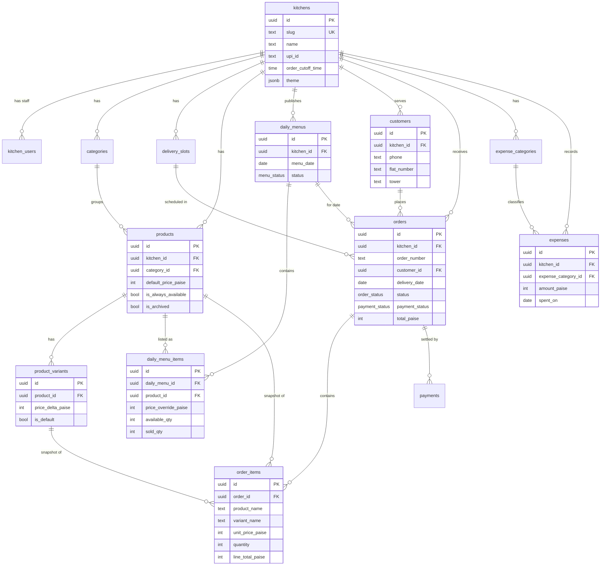

# HKOS — Entity Relationship Diagram

All business tables are tenant-scoped by `kitchen_id`. Money is stored in
integer **paise**. Every table has `created_at` / `updated_at`; most also have
`deleted_at` (soft delete).

## Key relationships & rules

- **`kitchens`** is the tenant root. `current_kitchen_ids()` (a `SECURITY
  DEFINER` helper) resolves the caller’s kitchens for every RLS policy.
- **`daily_menu_items.available_qty` / `sold_qty`** implement limited batches.
  `place_order` increments `sold_qty` atomically and rejects over-selling.
- **`order_items`** snapshot `product_name`, `variant_name`, and
  `unit_price_paise` so historical orders never change when a product is edited.
- **`orders.order_number`** is a per-kitchen human code (e.g. `ARO-1043`),
  assigned by the `assign_order_number` BEFORE-INSERT trigger.
